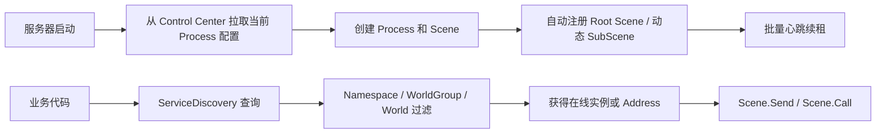

# 服务发现使用指南

Fantasy 服务发现由 Fantasy.Net 和 Fantasy Control Center 协作完成：Control Center 管理并持久化服务器拓扑，Fantasy.Net 自动注册 Root Scene 和运行时创建的 SubScene、发送批量心跳，并为业务代码提供查询和路由 API。

服务发现适合以下场景：

- 多台服务器分别启动不同的 Process 和 Scene。
- 动态增加或下线同类型服务实例。
- 按 Namespace 隔离多套游戏环境。
- 按 WorldGroup 或 World 查询指定区服范围内的服务。
- 创建副本、房间等 SubScene 后，让其他服务器按父 Root Scene 查询并通信。
- 随机负载均衡或使用 Rendezvous Hash 做稳定路由。

## 工作流程



开发者不需要手动调用注册、心跳或下线接口。它们由 Fantasy.Net 在服务器生命周期内自动完成。

## 一、准备 Control Center

仓库已经在 [`Tools/ControlCenter`](../../../Tools/ControlCenter/) 中提供编译好的 Control Center，无需重新编译源码。运行前请确保已安装 [.NET 8 ASP.NET Core Runtime](https://dotnet.microsoft.com/download/dotnet/8.0)。

### Windows

双击 [`Run.bat`](../../../Tools/ControlCenter/Run.bat)，或者在仓库根目录执行：

```bat
cd Tools\ControlCenter
Run.bat
```

### Linux / macOS

运行 [`Run.sh`](../../../Tools/ControlCenter/Run.sh)：

```bash
cd Tools/ControlCenter
./Run.sh
```

启动成功后，在浏览器访问：

```text
http://127.0.0.1:5277
```

默认仅允许本机访问，配置和运行数据会持久化到 `Tools/ControlCenter/data`。监听地址、数据目录和日志级别可以在 [`appsettings.json`](../../../Tools/ControlCenter/appsettings.json) 中修改。停止服务时在运行终端按 `Ctrl+C`。

进入管理后台后，按下面的顺序创建拓扑：

1. Namespace
2. Machine
3. Process
4. WorldGroup
5. World 和 Database
6. Scene

示例拓扑：

| 类型 | ID | 名称 | 归属 |
|---|---:|---|---|
| Namespace | 1 | Production | - |
| Machine | 1 | Gate-01 | - |
| Machine | 2 | Map-01 | - |
| Process | 1 | GateProcess | Namespace 1 / Machine 1 |
| Process | 2 | MapProcess | Namespace 1 / Machine 2 |
| WorldGroup | 1 | Group-A | Namespace 1 |
| World | 1 | World-1 | Namespace 1 / Group-A |
| World | 2 | World-2 | Namespace 1 / Group-A |
| Scene | 1001 | Gate | Process 1 / World 1 |
| Scene | 2001 | Map | Process 2 / World 1 |
| Scene | 2002 | Map | Process 2 / World 2 |

Control Center 中配置的 `SceneType` 必须与 `Fantasy.config` 中声明的名称完全一致。

### 查询服务实例

“服务实例”页面可以组合使用状态、Namespace、WorldGroup、World 分组和关键词查询。关键词会即时匹配 SceneType、SceneId、Address、ParentAddress、InstanceId、Host 以及拓扑名称；查询只过滤当前内存中的注册表视图，不会产生额外的数据库请求，也不会改变服务发现结果。

## 二、启用服务发现

在 `Fantasy.config` 中增加 `controlCenter`：

```xml
<controlCenter enabled="true"
               url="http://127.0.0.1:5277"
               fallbackToLocal="false"
               heartbeatIntervalSeconds="5"
               leaseSeconds="15">
  <sceneTypes>
    <sceneType id="1" name="Gate" />
    <sceneType id="2" name="Map" />
    <sceneType id="3" name="Auth" />
  </sceneTypes>
</controlCenter>

<!-- XSD要求server节点始终存在 -->
<server />
```

参数说明请参考 [Fantasy.config 配置文件详解](../../01-Server/01-ServerConfiguration.md)。

`sceneTypes` 是编译期声明：

- 新增已有类型的 Scene 实例，不需要修改配置或重新编译。
- 新增全新的 Scene 类型，需要增加一个 `sceneType` 并重新编译。
- `id` 必须稳定，发布后不要修改或重复使用。

## 三、启动服务器

生产环境通常让每个 OS 进程只启动一个 Fantasy Process：

```bash
# 启动Gate Process
dotnet YourServer.dll -m Release --pid 1

# 在另一台服务器启动Map Process
dotnet YourServer.dll -m Release --pid 2
```

Release 模式指定 `--pid` 后，服务器只从 Control Center 拉取该 Process 需要的 Machine、World、Database 和 Scene 配置。

本地调试可以启动当前配置中的所有 Process：

```bash
dotnet YourServer.dll -m Develop
```

同一个 OS 进程中启动的所有 Process 必须属于同一个 Namespace。因此 Develop 模式不能在一个进程中同时启动不同 Namespace 的 Process。

启动完成后，日志中会出现类似信息：

```text
Runtime configuration loaded from Control Center. Revision: 12
Registered 3 service instances with Control Center.
```

## 四、自动注册与心跳

Fantasy.Net 会为当前 OS 进程中的所有 Root Scene 和动态 SubScene 创建一个后台服务发现 Worker。

| 生命周期事件 | 自动行为 |
|---|---|
| Scene 全部启动成功 | 逐个注册当前进程中的 Scene |
| `CreateSubScene` 完成 | 立即注册到所属 Root Scene 下，不等待下一次心跳 |
| 注册完成 | 立即发送一次批量心跳 |
| 正常运行 | 按 `heartbeatIntervalSeconds` 批量续租 |
| Control Center 重启或丢失实例 | 心跳被拒绝后自动重新注册对应实例 |
| 网络短暂断开 | 自动重试，同一次故障只记录一次警告 |
| 服务器正常关闭 | 主动停止心跳并将实例标记为下线 |
| `SubScene.Close()` | 先主动下线，再销毁 SubScene |
| Root Scene 关闭 | 同时下线它管理的全部 SubScene |
| 服务器异常退出 | 等待 `leaseSeconds` 到期后自动失效 |

单批心跳最多携带 4096 个实例；超过时框架会自动拆成多批。

### 计划缩容：先摘流，再关闭 Scene

直接调用 `Scene.Close()` 时，框架会在销毁前主动下线。需要先迁移玩家、等待副本结束或排空请求时，可以提前摘流，让 Scene 继续运行但不再进入新的服务发现结果：

```csharp
await NetServiceDiscovery.SetSceneOfflineAsync(scene);

// 等待其他服务器的旧发现快照过期。
await FTask.Wait(
    scene,
    ProgramDefine.ControlCenterHeartbeatIntervalSeconds * 1000L);

// 在这里迁移玩家或等待现有任务结束。
await scene.Close();
```

Root Scene 摘流时会同时摘除它下面的全部 SubScene。调用成功只阻止新的发现结果；已经持有该 Address 的服务器仍可继续发送消息，因此业务层还应进入“停止接收新分配”的状态。摘流后不会自动重新注册，适用于后续确定要关闭的 Scene。

## 五、调用服务发现 API

公共入口位于：

```csharp
Fantasy.ServiceDiscovery
```

建议使用别名避免与项目中的同名命名空间冲突：

```csharp
using NetServiceDiscovery =
    Fantasy.ServiceDiscovery;
```

### API 一览

| API | 返回值 | 用途 |
|---|---|---|
| `DiscoverAsync` | 在线端点只读列表 | 获取全部匹配实例，自行选择 |
| `DiscoverAddressAsync` | `long` | 随机选择一个实例 |
| `DiscoverAddressByHashAsync` | `long` | 使用 Rendezvous Hash 稳定选择实例 |
| `DiscoverSubScenesAsync` | 在线端点只读列表 | 查询指定 Root Scene 下的 SubScene |
| `DiscoverSubSceneAddressAsync` | `long` | 随机选择指定 Root Scene 下的 SubScene |
| `DiscoverSubSceneAddressByHashAsync` | `long` | 对指定 Root Scene 下的 SubScene 做稳定选择 |
| `SetSceneOfflineAsync` | `FTask` | 提前摘除本机 Scene，但不立即销毁 |

六组查询 API 都提供 `int sceneType` 和 `string sceneType` 重载。推荐使用源生成器生成的 `SceneType.Map` 等常量，避免字符串拼写错误。

查询范围参数：

```csharp
uint? worldId = null;
uint? worldGroupId = null;
```

- 两者都不传：查询当前 Namespace 中该类型的所有实例。
- 只传 `worldId`：查询当前 Namespace 指定 World 的实例。
- 只传 `worldGroupId`：查询当前 Namespace 指定 WorldGroup 的实例。
- 两者不能同时传，也不能传 `0`。
- Namespace 由当前 Process 自动确定，业务代码不能跨 Namespace 查询。

上述 World 和 WorldGroup 参数只用于 Root Scene 查询。SubScene 必须使用父 Root Scene 的 `Address` 查询，不能脱离父节点做全局扫描。

## 六、获取全部在线实例

```csharp
var endpoints =
    await NetServiceDiscovery.DiscoverAsync(SceneType.Map);

foreach (var endpoint in endpoints)
{
    Log.Info(
        $"Instance:{endpoint.InstanceId} " +
        $"Scene:{endpoint.SceneId} " +
        $"World:{endpoint.WorldId} " +
        $"Host:{endpoint.Host}:{endpoint.InnerPort}");
}
```

`DiscoverAsync` 返回的 `ServiceEndpointContract` 只包含建立连接和路由需要的字段：

| 字段 | 说明 |
|---|---|
| `InstanceId` | 本次启动的服务实例唯一 ID |
| `SceneId` | 用于建立连接的 Root Scene ID；SubScene 返回其父 Root Scene 的 ID |
| `Address` | 实际消息目标的 Address；SubScene 返回自身 Address |
| `IsSubScene` | 是否为动态 SubScene |
| `ParentInstanceId` | 父 Root Scene 的实例 ID；Root Scene 为空 |
| `ParentAddress` | 父 Root Scene 的 Address；Root Scene 为 `0` |
| `NamespaceId` | 所属 Namespace |
| `WorldGroupId` | 所属 WorldGroup |
| `WorldId` | 所属 World |
| `ProcessId` | 所属 Process |
| `Host` | 内网连接地址 |
| `InnerPort` | 服务器内部通信端口 |
| `OuterPort` | 对外服务端口，`0` 表示未开放 |

不要依赖返回列表的顺序。如果需要自定义负载策略，应使用稳定字段自行选择实例。

## 七、按 World 或 WorldGroup 查询

### 指定 World

```csharp
var worldId = session.Scene.SceneConfig.WorldConfigId;

var maps =
    await NetServiceDiscovery.DiscoverAsync(
        SceneType.Map,
        worldId: worldId);
```

### 指定 WorldGroup

```csharp
const uint worldGroupId = 1;

var maps =
    await NetServiceDiscovery.DiscoverAsync(
        SceneType.Map,
        worldGroupId: worldGroupId);
```

WorldGroup 适合把多个区服划入同一个服务范围，例如让同组 World 共用跨服匹配、聊天或排行榜服务。

## 八、随机选择一个实例

`DiscoverAddressAsync` 适合无状态、任意实例都可以处理的服务：

```csharp
var address =
    await NetServiceDiscovery.DiscoverAddressAsync(
        SceneType.Map,
        worldId: session.Scene.SceneConfig.WorldConfigId);

if (address == 0)
{
    throw new InvalidOperationException(
        "No online Map scene was discovered.");
}

var response = await session.Scene.Call(
    address,
    new G2A_TestRequest());
```

也可以发送单向 Address 消息：

```csharp
session.Scene.Send(address, message);
```

所有发现查询都会缓存返回实例所属 Root Scene 的网络端点。后续 `Scene.Send` 和 `Scene.Call` 会自动使用发现到的 Host 与 InnerPort 建立内部连接。

没有在线实例时，两个 Address 查询 API 都返回 `0`，业务代码必须处理该情况。

## 九、使用 Rendezvous Hash 稳定路由

`DiscoverAddressByHashAsync` 适合希望相同 Key 尽量落到相同服务实例的场景：

```csharp
var address =
    await NetServiceDiscovery.DiscoverAddressByHashAsync(
        SceneType.Auth,
        routingKey: accountId);

if (address == 0)
{
    throw new InvalidOperationException(
        "No online Auth scene was discovered.");
}
```

框架使用端点的 `Address` 作为节点标识：

- 相同节点集合和 routingKey 会得到相同结果。
- 增加或删除节点时，只会重新分配部分 Key。
- 不创建哈希环，查询过程不会分配临时集合。
- SubScene 销毁后重新创建会获得新的 Address，因此会被视为新节点。

### 严格账号归属需要单独持久化

Rendezvous Hash 提供的是稳定选择，不是永久绑定。扩容或缩容后，一部分账号会合理地迁移到其他节点。

如果业务要求账号断线重连、顶号或下次登录时必须回到之前的鉴权服务器，应将下面的绑定单独保存到 Redis 或数据库：

```text
AccountId -> Auth SceneId
```

推荐流程：

1. 先读取账号已有的 Auth SceneId 绑定。
2. 该 Scene 仍在线时继续使用。
3. 没有绑定或原 Scene 已下线时，再使用 Rendezvous Hash 选择新节点。
4. 更新账号绑定。

这类有状态会话归属属于业务状态，不应保存在服务发现系统中。

## 十、使用字符串重载

需要根据配置或业务字符串查询时，可以使用：

```csharp
var endpoints =
    await NetServiceDiscovery.DiscoverAsync(
        "Map",
        worldId: 1);
```

字符串仍然必须存在于当前编译生成的 SceneType 字典中。对于固定类型，优先使用 `SceneType.Map`。

## 十一、完整 Handler 示例

下面的例子来自仓库示例，验证相同 Key 的稳定路由，并发送一次 Address RPC：

```csharp
using System;
using Fantasy.Async;
using Fantasy.Network;
using Fantasy.Network.Interface;
using NetServiceDiscovery =
    Fantasy.ServiceDiscovery;

namespace Fantasy.Gate;

public sealed class C2G_TestRequestHandler
    : MessageRPC<C2G_TestRequest, G2C_TestResponse>
{
    protected override async FTask Run(
        Session session,
        C2G_TestRequest request,
        G2C_TestResponse response,
        Action reply)
    {
        const long routingKey = 10001;
        var worldId = session.Scene.SceneConfig.WorldConfigId;

        var firstAddress =
            await NetServiceDiscovery
                .DiscoverAddressByHashAsync(
                    SceneType.Map,
                    routingKey,
                    worldId);

        if (firstAddress == 0)
        {
            throw new InvalidOperationException(
                "No online Map scene was discovered.");
        }

        var secondAddress =
            await NetServiceDiscovery
                .DiscoverAddressByHashAsync(
                    SceneType.Map,
                    routingKey,
                    worldId);

        if (firstAddress != secondAddress)
        {
            throw new InvalidOperationException(
                "Consistent hash returned different addresses.");
        }

        _ = await session.Scene.Call(
            firstAddress,
            new G2A_TestRequest());
    }
}
```

仓库中的可编译完整文件位于：

```text
examples/Server/APP/Hotfix/Functional Examples/Outer/NormalMessage/Gate/C2G_TestRequestHandler.cs
```

## 十二、SubScene 动态注册、发现与通信

SubScene 适合副本、匹配房间和临时战场。启用 Control Center 后，仍然使用原来的创建 API：

```csharp
var dungeon = await Scene.CreateSubScene(
    mapScene,
    SceneType.Map,
    onSubSceneSetup: async (subScene, parentScene) =>
    {
        subScene.AddComponent<DungeonComponent>();
        await FTask.CompletedTask;
    });

var dungeonAddress = dungeon.Address;
```

创建顺序是：初始化 SubScene、执行回调、发布 `OnCreateScene`、立即注册到 Control Center，最后才完成 `CreateSubScene`。因此返回后可以安全地把 `dungeon.Address` 发送给其他服务器。SubScene 的 SceneType 也必须声明在 `<controlCenter><sceneTypes>` 中。

### 查询指定 Root Scene 下的 SubScene

```csharp
var dungeons =
    await NetServiceDiscovery.DiscoverSubScenesAsync(
        parentAddress: mapRootAddress,
        sceneType: SceneType.Map);

foreach (var endpoint in dungeons)
{
    Log.Info(
        $"SubScene:{endpoint.Address} " +
        $"Parent:{endpoint.ParentAddress}");
}
```

随机选择一个子场景：

```csharp
var dungeonAddress =
    await NetServiceDiscovery.DiscoverSubSceneAddressAsync(
        mapRootAddress,
        SceneType.Map);

if (dungeonAddress == 0)
{
    throw new InvalidOperationException(
        "No online dungeon was discovered.");
}

var response = await scene.Call(
    dungeonAddress,
    new G2Dungeon_EnterRequest());
```

需要相同业务 Key 尽量命中同一个在线子场景时，使用：

```csharp
var dungeonAddress =
    await NetServiceDiscovery.DiscoverSubSceneAddressByHashAsync(
        mapRootAddress,
        SceneType.Map,
        routingKey: teamId);
```

查询必须传父 **Root Scene** 的 Address。返回端点中，`Address` 是 SubScene 自身的消息目标，`SceneId`、`Host` 和 `InnerPort` 则指向它所属的 Root Scene 网络入口，因此其他服务器不需要为每个 SubScene 建立独立监听端口。

如果创建者已经通过 RPC 或事件把 SubScene Address 直接发给其他服务器，对方可以立即调用 `Scene.Send(address, message)` 或 `await Scene.Call(address, request)`。本地缺少路由时，框架会根据 Address 中的 SceneId 解析所属 Root Scene；业务代码通常不需要手动调用 `ResolveAddressAsync`。

### 关闭与可见性

```csharp
await dungeon.Close();
```

`Close()` 会先向 Control Center 主动下线，再销毁 SubScene。SubScene 列表查询仍使用本地快照：如果其他服务器刚好缓存了旧列表，最多会在一个缓存周期内看到旧端点。因此低延迟创建流程应直接传递新 Address，而不是轮询发现列表等待它出现；发送失败仍要按普通网络错误处理。

## 十三、缓存与故障行为

服务发现客户端不会在每次查询时访问 Control Center：

- Root Scene 缓存键由 SceneType、World/WorldGroup 查询范围组成；SubScene 缓存键由 SceneType 和父 Root Scene Address 组成。
- 缓存时间使用 `heartbeatIntervalSeconds`。
- 同一个缓存键过期时，只允许一个请求刷新，其他调用等待同一结果。
- Control Center 短暂不可用且已有旧快照时，继续返回旧快照并在下个缓存周期重试。
- 第一次查询没有快照且 Control Center 不可用时，向调用方抛出异常。

因此实例下线后，客户端最多可能在一个缓存周期内仍看到旧结果。调用失败仍应由业务层按正常网络错误处理，不能把缓存当成强一致状态。

## 十四、部署注意事项

### 网络地址

服务注册使用 Machine 的 `innerBindIP` 作为 Host。多机部署时，该地址必须能被其他服务器直接访问：

- 不要使用其他机器无法访问的 `127.0.0.1`。
- 容器部署时应配置可路由的容器地址、宿主机地址或内部域名。
- 防火墙和安全组必须放行 Scene 的 `innerPort`。

### Control Center 安全

Control Center 包含拓扑管理和服务注册接口，不应无保护地直接暴露到公网。部署到外网时至少应使用：

- HTTPS 反向代理。
- 防火墙、内网、VPN 或 IP 白名单。
- 在反向代理或网关增加身份认证。
- 仅向需要连接的服务器开放服务发现 API。

### 心跳和租约

推荐保持默认配置：

```xml
heartbeatIntervalSeconds="5"
leaseSeconds="15"
```

租约应至少是心跳间隔的 3 倍。过短会让网络抖动导致实例频繁上下线，过长会延迟异常实例的摘除。

## 十五、常见问题

### `Service discovery is not enabled.`

当前服务器没有成功启用 Control Center。检查 `controlCenter.enabled`、`url` 和启动日志。

### `SceneType id/name is not declared.`

查询的类型没有声明在 `controlCenter.sceneTypes` 中，或者当前项目还没有重新编译。

### 查询返回空列表或 Address 为 `0`

依次检查：

1. 目标 Scene 是否已经启动并注册。
2. Scene、Process、World、WorldGroup 是否启用。
3. 调用方和目标是否属于同一个 Namespace。
4. `worldId` 或 `worldGroupId` 是否正确。
5. 目标实例的租约是否已经过期。

### 能发现实例但连接失败

检查返回端点的 `Host` 和 `InnerPort` 是否能从调用服务器访问，并确认防火墙、安全组和容器端口映射。

### SubScene 已创建但查询不到

依次检查 SubScene 的 SceneType 是否已声明、父 Root Scene 是否已注册，以及查询传入的是否为该父 Root Scene 的 Address。若调用方已有旧快照，等待一个缓存周期；实时业务应由创建方直接传递 SubScene Address。

### Control Center 重启后是否需要重启游戏服务器？

不需要。下一次批量心跳会收到被拒绝的实例列表，Fantasy.Net 会自动重新注册这些 Scene。

### 是否可以同时指定 World 和 WorldGroup？

不可以。两者是互斥的查询范围；如果都不指定，则查询当前 Namespace 的全部匹配实例。

## 十六、迁移建议

旧的静态拓扑代码通常直接从 `SceneConfigData` 取固定下标：

```csharp
var map = SceneConfigData.Instance
    .GetSceneBySceneType(SceneType.Map)[0];
```

启用服务发现后，不要依赖固定下标或对服务数量取模。改为：

```csharp
var address =
    await NetServiceDiscovery.DiscoverAddressAsync(
        SceneType.Map,
        worldId: worldId);
```

需要稳定路由时使用 `DiscoverAddressByHashAsync`；需要严格持久归属时，在业务数据库中保存 SceneId 绑定。

## 相关文档

- [Fantasy.config 配置文件详解](../../01-Server/01-ServerConfiguration.md)
- [命令行参数](../../01-Server/03-CommandLineArguments.md)
- [Address 消息](06-Address消息.md)
- [Scene 和 SubScene](../CoreSystems/03-Scene.md)
